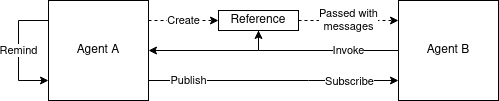
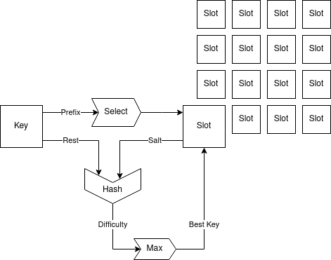
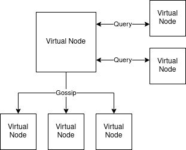
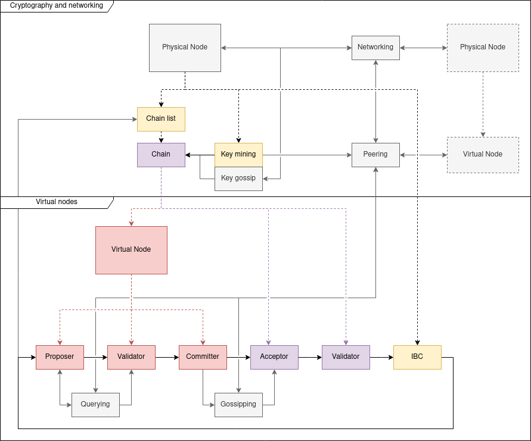

# Apocryph 
Consensus Network for Autonomous Agents

> Apocryph Agents can automate the cash flow in autonomous organizations, optimize city traffic, or reward the computing power used to train their own neural networks.

[](https://discord.gg/ESr9KMR)

## Table of Contents

- [Overview](#overview)
  - [Quick Summary](#quick-summary)
- [Getting Started](#getting-started)
  - [Prerequisite](#prerequisite)
  - [Project Structure](#project-structure)
  - [Local Development](#local-development)
  - [Create agents](#create-agents)
  - [Run multi-agent distributed application](#run-multi-agent-distributed-application)
- [Apocryph Architecture Overview](#apocryph-architecture-overview)
  - [Agent Model](#agent-model)
    - [State](#state)
    - [Reminders](#reminders)
    - [Publish and Subscribe](#publish-and-subscribe)
    - [Object Capability Security Model](#object-capability-security-model)
    - [Call Balances](#call-balances)
    - [Invocations](#invocations)
  - [Consensus](#consenus)
    - [Selection](#selection)
    - [Querying](#querying)
    - [Gossiping](#gossiping)
    - [Agent Zero](#agent-zero)
    - [Inter Blockchain Communication](#inter-blockchain-communication)
  - [Network Nodes](#network-nodes)
    - [Client and Services](#client-and-services)
    - [Availability](#availability)
- [Test Harness](#test-harness)
- [Contributing](#contributing)

## Overview

Apocryph is a new consensus network for autonomous agents. From developer perspective,
we have put a great focus on selecting a technology stack comprising widely adopted platforms,
tools and development paradigms.

Apocryph is built on top of [Perper](https://github.com/obecto/perper) — a stream-based, horizontally 
scalable framework for asynchronous data processing. You can learn more about Perper and Apocryph in the video below:

[](https://www.youtube.com/watch?v=lCiZ3x8IRvI)

Also, you can see a short video of how easy it is to setup Apocryph test node on your 
local development machine using only Docker and Docker-Compose:

[](https://asciinema.org/a/295036?speed=2&rows=30)

### Quick Summary

Apocryph is an architecture:

- defines patterns and practices for building distributed systems
- covers both open-source and closed-source parts of the system being built
- compliant with the latest enterprise-grade software architectures and technologies

Apocryph is a framework:

- has built-in library for building multi-agent systems
- supports both active and passive agents

Apocryph is a blockchain:

- implements highly scalable leaderless consensus 
- designed in mind with inter-blockchain communication

Apocryph is an economy:

- supports fully programmable digital economy model
- accommodates both humans and AI actors 

## Getting Started

This is a quick start guide of how to create a simple multi-agent system
using Apocryph. The guide explains [sample agent application](https://github.com/comrade-coop/apocryph/tree/master/samples/SampleAgents.FunctionApp) in our repo.

### Prerequisite

Before running this guide, you must have the following:

- Install [Azure Functions Core Tools v3](https://docs.microsoft.com/en-us/azure/azure-functions/functions-run-local#v2)
- Install [.NET Core SDK 3.1](https://dotnet.microsoft.com/download/dotnet-core/3.1)
- Install [Docker](https://docs.docker.com/install/)

### Project Structure

> **NOTE:** As a best practice, the agents should be developed as a separate Class Library 
that is referenced by the function app project.

The most suitable project type for Apocryph Agent development is Azure Functions Project.
The [project](https://github.com/comrade-coop/apocryph/blob/master/samples/SampleAgents.FunctionApp) can contain a single agent or multiple agents running on the same chain. 
The [project](https://github.com/comrade-coop/apocryph/blob/master/samples/SampleAgents.FunctionApp/SampleAgents.FunctionApp.csproj) has dependency to [Perper](https://github.com/obecto/perper) and [Apocryph Agent Library](https://github.com/comrade-coop/apocryph/blob/master/src/Apocryph.Core.Agent/Apocryph.Core.Agent.csproj)

### Local Development

To enable local development and debugging of you multi-agent application you have to include 
a tiny [boilerplate code](https://github.com/comrade-coop/apocryph/blob/master/samples/SampleAgents.FunctionApp/Launcher.cs) in your function application. This boilerplate code
will configure and launch Apocryph Runtime in local development mode.

### Create agents

Every multi-agent application has a special agent responsible for bootstrapping
the application. In our sample application this is [AgentOne](https://github.com/comrade-coop/apocryph/blob/master/samples/SampleAgents.FunctionApp/Agents/AgentOne.cs). You can use any other name that is more suitable for your multi-agent system domain (for example: "Organization", "Template" or other). This name indicates the first agent you have to create, serving as entry point to your multi-agent system.

For local debugging purpose, the agents are deployed as Azure Functions, so they require a
another tiny boilerplate typically co-located with the Agent source code. In our example this is
[AgentOneWrapper](https://github.com/comrade-coop/apocryph/blob/master/samples/SampleAgents.FunctionApp/Agents/AgentOne.cs).

### Run multi-agent distributed application

To run your multi-agent application you have to first run the Apocryph Runtime
in local development mode. This can be done by using docker-compose file provided
in the docker folder of our [repo](https://github.com/comrade-coop/apocryph/tree/master/docker).

## Apocryph Architecture Overview

From architecture standpoint Apocryph can be viewed as a framework for
developing multi-agent systems running on a decentralized network. The framework
comprises of three main layers: [Agent Model](#agent-model), [Consensus](#consensus), and [Network Nodes](#network-nodes).
 
### Agent Model

Multi-agent systems typically consists of number of agents that interact with 
their environment. Apocryph agents follow the same model, they can observe 
the environment by subscribing to the output of other agents, services and 
based on these observations, the agents can emit own publications or pro-actively
engage with other agents. Therefore, Apocryph support both passive, active and
cognitive agents.

Every interaction between the agents and the environment or between the agents
is represented as a command. This allows agents to be executed asynchronously
in a reproducible way.

> **Determinism:** Apocryph agents are implemented using high level languages - 
C# and Python. It is developer responsibility to write deterministic agents that can 
reach consensus on the decentralized network. There are variety of well known practices
and linters for writing deterministic code, for example: *use deterministic seed for 
pseudo-random number generation; avoid floating point types or use them with extra caution; 
avoid undeterministic language features (such as dictionary iterators or uninitialized memory)*.



#### State

Apocryph agents can be viewed as state machine—they receive messages, update their state, and 
output new messages (in the form of commands). The internal state of the agent is an opaque 
object for the network and its structure is known only to its agent owner.

#### Reminders

The Remind command allows agents to be activated when a specific deadline (point in time) 
is reached. Upon activation the agent receives a message specified at the time when the 
command has been emitted. 

> **Time:** There is no guarantee of the time gap between the time of agent activation 
and the requested deadline by the agent.

#### Publish and Subscribe

The Publish and subscribe commands allows the agents to observe and change the environment 
by indirectly exchanging messages. Every agent has a public topic associated with the 
agent identifier where the agent can emit arbitrary information and the subscribing agents
gets activated on new publications. An agent can dynamically subscribe to an arbitrary number
of public topics of other agents.

#### Object Capability Security Model

Apocryph agents can directly interact between each other over [object capabilities](https://wiki.c2.com/?ObjectCapabilityModel). An Apocryph 
object capability contains whitelisted message types and is created locally by the agent. Then the 
agent can distribute the newly created capability by embedding it in messages. Apocryph agents can 
store capabilities (both their own capabilities and capabilities received from other agents) in 
their state for later use.

Security and unforgeability of all object capabilities used by the agents is implemented as part 
of the decentralized network that hosts the agents. All object capabilities are embedded in the 
blocks and the network has to agree on their authenticity before they can be used.

#### Call Balances

Direct inter-agent interactions incur costs for the receiving agents, as they have to process incomming messages. 
To cover for these costs every agent has an associated call balance and the respective costs are deducted from the balance 
of the sending party every interaction. Therefore the agent initiating the interaction has to transfer 
(directly or indirectly) the necessary funds in the receiving agent's call balance in prior of making the call. 
These balances are managed by a special public agent, named *Agent Zero* and are propagated through
the network. Withdraws of funds from the call balances is possible, however it is a slower operation, 
as it requires a gurantee of the propagation of the updated balance to prevent double spending.

#### Invocations

Invoke commands represent the direct communication between agents. The command encapsulates a specific 
message exchanged between two agents and the respective object capability. For the underlying decentralized 
network, the message is opaque object. Therefore it is up to the communicating agents to agree upon a protocol 
and serialization mechanism. The messages are also the mechanism for propagating state changes across the network 
and are also carriers of object capabilities.

### Consensus

From consensus standpoint, Apocryph is proof-of-work network augmented with leaderless Byzantine fault
tolerance protocol inspired by [Wavelet](https://wavelet.perlin.net/whitepaper.pdf) and [Himitsu](https://www.youtube.com/watch?v=C542HhQKzKQ). 

Every group of agents is operated by a separate blockchain with a separate consensus that runs in 
parallel with other's blockchain consensus instances. Every consensus instance runs over a 
number of dedicated virtual nodes with different roles (proposers or validators). The process of 
selecting virtual nodes, the respective role and forming the proof-of-work network is called *selection*.

Another building block of Apocryph protocol are *facts*. Facts can be slot claims, block confirmations,
block rejections, or externally signed blocks. The high level goal of the protocol is to enable virtual 
nodes to find the "ground truth" by combining their knowledge with observations of the facts produced
by other virtual nodes. Virtual nodes gather knowledge by *querying* other virtual nodes and validating their
responses. The observation of facts by a virtual node is achieved with *gossiping*.

#### Selection

Virtual nodes selection is done using algorithm inspired by [Automaton's King of the Hill](https://www.youtube.com/watch?v=UBmwzstJ5Fo) protocol. 
For every consensus instance there is matrix of slots (virtual nodes) which can be claimed by different 
physical nodes. For every slot there is also a random salt that changes periodically. Every node participating 
in the network tries to produce a private key with a public key which has a bytes prefix that corresponds to one 
of the slots, using an algorithm similar to [Vanitygen](https://en.bitcoin.it/wiki/Vanitygen). Upon discovery of a pair of public and private
keys with the desired properties the following procedure is initiated:

1. The prefix of the public key is used for selecting a slot
2. The rest of the public key is combined with the salt and hashed to produce the difficulty of the current pair.
3. A slot claim is produced and signed using the public/private pair of keys.
4. Gossip of the slot claim is distributed across the network.
5. The owner of the virtual node is selected based on the public key with highest difficulty for the slot.

The selection algorithm has the following properties:

1. If different KotH networks share the same cryptographic functions they can also share miners.
2. Keys with lower difficulty for a specific salt might have higher difficulty for another salt,
so nodes have incentive to store generated keys for later attempts.



#### Querying

Virtual nodes query each other to reach consensus for the next block. The querying mechanism 
is inspired by the [Snowball](https://ipfs.io/ipfs/QmUy4jh5mGNZvLkjies1RWM4YuvJh5o2FYopNPVYwrRVGV) protocol.

1. Some of the virtual nodes are selected as proposers, based on the last block hash.
    - As part of the selection process, they are also assigned an order—nodes selected earlier are considered "better".
1. If a node is a proposer, it generates a proposal for the next block and responds with it to all queries it receives.
2. All virtual nodes start [Snowball](https://ipfs.io/ipfs/QmUy4jh5mGNZvLkjies1RWM4YuvJh5o2FYopNPVYwrRVGV) queries to each other and respond with:
    - Their own opinion (if proposers) OR
    - Accept the query block proposal if it contains a proposal by a proposer earlier in the proposers list OR
    - The block proposal that they already have
3. Virtual node *commit* on the block proposal to which [Snowball](https://ipfs.io/ipfs/QmUy4jh5mGNZvLkjies1RWM4YuvJh5o2FYopNPVYwrRVGV) have converged.

In addition to the well known properties, Apocryph blocks have the following structure:

1. State
2. Commands
3. Object Capabilities
4. History (validators signatures from the last N valid blocks) 



#### Gossiping

Every virtual node validates the committed block and, based on the validation result, either marks the block as
*confirmed* (if valid) or *rejected* (if invalid). The virtual node then proceeds to gossiping the fact that it 
confirmed or rejected the block. Every other validator, gossips only facts that are consistent with its observations. 
When two thirds of the virtual nodes support a gossip, it gets accepted. If the accepted gossip is not consistent 
with the virtual node's observations (ex. a block determined as invalid is confirmed by most virtual nodes), then that 
virtual node doesn't accept the gossip and forks.

#### Agent Zero

The Apocryph network contains one well known agent, called Agent Zero, that provides the economic environment. Agent Zero 
is otherwise a regular agent that holds the following information in its state:

1. Main token balances
2. Agents call balances
3. Last (observed) blocks of agents' chains

It also responds to the following inter-agent communication messages:

1. Creating agents / chains
2. Deposit / withdraw of funds to call balances

The Agent Zero chain (also referred to as the *main chain*) has the same consensus as any other chain. All agents 
include a reference to the last block of the main chain in their blocks in order to maintain an unified economic model.

#### Inter Blockchain Communication

Gossiping exchanges facts across the whole network. Based on the gossips, virtual nodes can observe not only their chain, 
but also other chains in the network. When a virtual node observes an accepted block with invocation to its chain, it 
includes the invocation command in its the next proposal for the current chain, using the following process:

1. It validates the provided capabilities in the block from the other chain.
2. It checks if call balance is sufficient, by referring to the last known block on the main chain.
3. It generates a new block proposal, using the state from the previous accepted block on the current chain.

### Network Nodes

Apocryph is built on top of [Perper](https://github.com/obecto/perper)—a stream-based, horizontally 
scalable framework for asynchronous data processing. This enables Apocryph to run on physical nodes 
of various sizes: from a single machine using docker-compose to a datacenter grade cluster environment 
using [Kubernetes](http://kubernetes.io/). All physical (network) nodes form a decentralized network 
and communicate with each other using [IPFS](https://ipfs.io/).

Every network node has the following components running on it:

1. Runtime
2. Agents
3. Client
4. Services

All of the components runs in separate containers, where the components running user code (Agents and Services) run in sandboxed 
container environments using [gVisor](https://gvisor.dev/) 



#### Clients and Services

Client and Services are built-in mechanisms in Apocryph for interaction with the external world. Client exposes a Websocket
that allows thin clients (like mobile apps) to connect and observe the Apocryph environment by watching for certain facts that are gossiped.
Clients enable also end-users to interact with the Apocryph environment by enabling them to gossip specific facts (ex. deposit of funds) that might
be picked up by the proposers if they are valid.

Services can be considered as automated clients, that directly watch and interact with the Apocryph environment by observing / gossiping specific facts, 
typically to assist agents with specific operations (ex. training a neural network).

#### Availability

The separation between network nodes and virtual nodes enables high availability of the network. If a network node becomes 
unavailable, then another network node can eventually claim ownership of its virtual nodes and start hosting them.

In case of a temporary network partition, the two networks will progress independently and later converge as part of the querying process. 

### Test Harness

Using Docker Compose to run Apocryph runtime is the recommended way for users that
would like to run Apocryph Developer Node.

##### Prerequisites
- Install [Docker](https://docs.docker.com/install/)
- Install [Docker Compose](https://docs.docker.com/compose/install/)

##### Start IPFS Daemon

Apocryph uses IPFS for its DPoS consensus implementation, thus requiring an IPFS daemon to run locally on the node:

```bash
docker-compose up -d ipfs
```

##### Start Apocryph Runtime

Before running the Apocryph runtime locally you have to start Perper Fabric in local development mode:

- Create Perper Fabric IPC directory
```bash
mkdir -p /tmp/perper
```
- Run Perper Fabric Docker (This steps require pre-built Perper Fabric image. More information can be found [here](https://github.com/obecto/perper))
```bash
docker-compose up -d perper-fabric
```

Apocryph runtime is implemented as Azure Functions App and can be started with:
```bash
docker-compose up apocryph-runtime
```

## Contributing

Pull requests are welcome. For major changes, please open an issue first to discuss what you would like to change.

Please make sure to update tests as appropriate.

#### Prerequisites

Before running this sample, you need to have the following:

- The recommended operating system is Ubuntu 18.04 LTS.
- Install [Azure Functions Core Tools v3](https://docs.microsoft.com/en-us/azure/azure-functions/functions-run-local#v2)
- Install [.NET Core SDK 3.1](https://dotnet.microsoft.com/download/dotnet-core/3.1)
- Install [Docker](https://docs.docker.com/install/)
- Install [IPFS](https://ipfs.io/#install)

#### Enable Perper Functions

Apocryph is based on [Perper](https://github.com/obecto/perper) - stream-based,
horizontally scalable framework for asynchronous data processing. To run Apocryph 
make sure you have cloned Perper repo and have the correct path in Apocryph.proj file.

#### Start IPFS Daemon

Apocryph uses IPFS for its DPoS consensus implementation, thus requires IPFS daemon to run locally on the node:

```bash
ipfs daemon --enable-pubsub-experiment
```

#### Start Apocryph Runtime

Before running the Apocryph runtime locally you have to start Perper Fabric in local 
development mode:

- Building Perper Fabric Docker (in the directory where Perper repo is cloned)
```bash
docker build -t perper/fabric -f docker/Dockerfile .
```
- Create Perper Fabric IPC directory  
```bash
mkdir -p /tmp/perper
```
- Run Perper Fabric Docker 
```bash
docker run -v /tmp/perper:/tmp/perper --network=host --ipc=host -it perper/fabric
```

Apocryph runtime is implemented as Azure Functions App and can be started with:
```bash
func start
```
