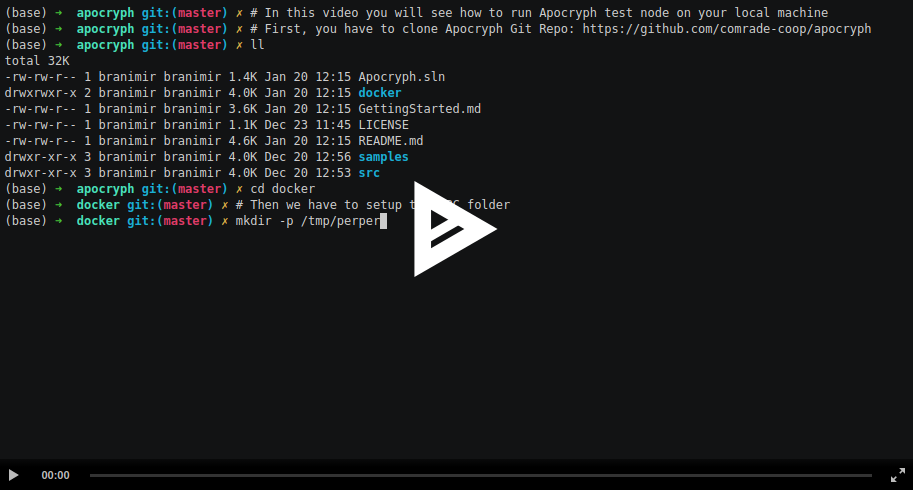
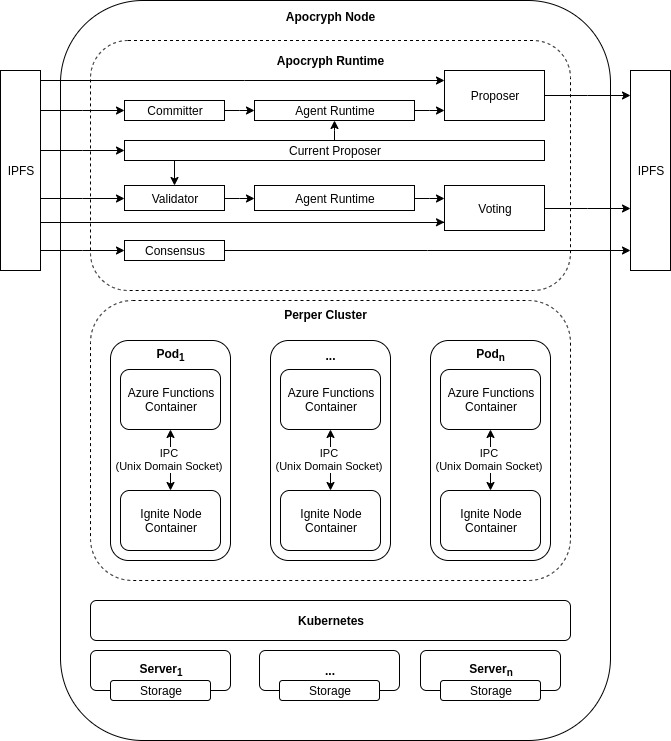

# Apocryph 
Consensus Network for Autonomous Agents

> Apocryph Agents can automate the cash flow in autonomous organizations, optimize city traffic, or reward the computing power used to train their own neural networks.

[](https://discord.gg/ESr9KMR)

## Table of Contents

- [Overview](#overview)
  - [Quick Summary](#quick-summary)
- [Getting Started](#getting-started)
  - [Prerequisite](#prerequisite)
  - [Create project](#create-project)
  - [Enable testbed](#enable-testbed)
  - [Configure testbed](#configure-testbed)
  - [Create your agents](#create-your-agents)
  - [Run your first multi-agent distributed application](#run-your-first-multi-agent-distributed-application)
- [How Apocryph works?](#how-apocryph-works)
  - [Agent Model](#agent-model)
    - [Reminders](#reminders)
    - [Publish and Subscribe](#publish-and-subscribe)
    - [Object Capability Security Model](#object-capability-security-model)
    - [Call Tickets](#call-tickets)
    - [Invocations](#invocations)
    - [Services](#services)
  - [Consensus](#consenus)
    - [Modularity](#modularity)
    - [Inter Blockchain Communication](#inter-blockchain-communication)
  - [Network Nodes](#network-nodes)
    - [Scalability](#scalability)
    - [Developer Node](#developer-node)
- [Contributing](#contributing)

## Overview

Apocryph is a new consensus network for autonomous agents. From developer perspective,
we have put a great focus on selecting a technology stack comprising widely adopted platforms,
tools and development paradigms.

Below, you can see a short video of how easy it is to setup Apocryph test node on your 
local development machine using only Docker and Docker-Compose:

[](https://asciinema.org/a/295036?speed=2&rows=30)

### Quick Summary

Apocryph is an architecture:

- defines patterns and practices for building distributed systems
- covers both open-source and closed-source parts of the system being built
- compliant with the latest enterprise-grade software architectures and technologies

Apocryph is a framework:

- has built-in library for building multi-agent systems
- supports both proactive and passive agents

Apocryph is a blockchain *(implementation in-progress)*:

- implements highly scalable DPoS BFT consensus 
- designed to be inter-blockchain communication ready

Apocryph is an economy *(implementation in-progress)*:

- supports fully programmable digital economy model
- accommodates both humans and AI actors 

## Getting Started

This is a quick start guide of how to create a simple multi-agent system
using Apocryph.  

### Prerequisite

Before running this guide, you must have the following:

- Install [Azure Functions Core Tools v3](https://docs.microsoft.com/en-us/azure/azure-functions/functions-run-local#v2)
- Install [.NET Core SDK 3.1](https://dotnet.microsoft.com/download/dotnet-core/3.1)
- Install [Docker](https://docs.docker.com/install/)

### Create project

> **NOTE:** As a best practice, the agents should be developed as a separate Class Library 
that is referenced by the function app project.

Run the following command from the command line to create a function app project 
in the SampleApp folder of the current local directory. For simplicity this 
project will contain both the agents source code and testbed configuration (*see the note above*).

```bash
func init SampleApp
```

When prompted, select a worker runtime - for now only dotnet is fully supported.

After the project is created, use the following command to navigate to the new SampleApp project folder.

```bash
cd SampleApp
````
### Enable testbed

To run your agents on your developer machines you can use the 
Apocryph testbed. To use it, you have to clone Apocryph GitHub repo
and add reference to Apocryph.Agents.Testbed. 

There are two more NuGet packages that are required:

- Microsoft.Azure.Functions.Extensions
- Microsoft.NET.Sdk.Functions

After theese configurations, your project file will be similar to this:

```xml
<Project Sdk="Microsoft.NET.Sdk">

    <PropertyGroup>
        <TargetFramework>netcoreapp3.1</TargetFramework>
        <AzureFunctionsVersion>v3</AzureFunctionsVersion>
        <LangVersion>8</LangVersion>
        <Nullable>enable</Nullable>
    </PropertyGroup>

    <ItemGroup>
        <None Update="host.json">
            <CopyToOutputDirectory>PreserveNewest</CopyToOutputDirectory>
        </None>
        <None Update="local.settings.json">
            <CopyToOutputDirectory>PreserveNewest</CopyToOutputDirectory>
            <CopyToPublishDirectory>Never</CopyToPublishDirectory>
        </None>
    </ItemGroup>
    
    <ItemGroup>
      <ProjectReference Include="..\..\Apocryph.Agents.Testbed\Apocryph.Agents.Testbed.csproj" />
    </ItemGroup>
    
    <ItemGroup>
      <PackageReference Include="Microsoft.Azure.Functions.Extensions" Version="1.0.0" />
      <PackageReference Include="Microsoft.NET.Sdk.Functions" Version="3.0.5" />
    </ItemGroup>

</Project>
```

### Configure testbed

Using the testbed requires adding a small portion of boilerplate code that
will enable a local execution of your agents. Using this you can debug
your agents as regular .NET project.

First, you have to enable the testbed and the logging as services. To do this add
Startup.cs file in the root of your project:

```csharp
using Apocryph.Agents.Testbed;
using Microsoft.Azure.Functions.Extensions.DependencyInjection;
using Microsoft.Extensions.DependencyInjection;

[assembly: FunctionsStartup(typeof(SampleApp.Startup))]

namespace SampleApp
{
    public class Startup : FunctionsStartup
    {
        public override void Configure(IFunctionsHostBuilder builder)
        {
            builder.Services.AddLogging();
            builder.Services.AddTransient(typeof(Testbed), typeof(Testbed));
        }
    }
}
```

You also have to enable the logging in the host.json:

```json
{
    "version": "2.0",
    "logging": {
        "logLevel": {
            "SampleApp": "Trace"
        }
    }
}
```

Second, you have to create the testbed functions used as main entrypoints
for setting up the agents execution environment. To do this add App.cs file 
in the root of your project:

```csharp
using System.Collections.Generic;
using System.Threading;
using System.Threading.Tasks;
using Apocryph.Agents.Testbed;
using Apocryph.Agents.Testbed.Api;
using Microsoft.Azure.WebJobs;
using Perper.WebJobs.Extensions.Config;
using Perper.WebJobs.Extensions.Model;

namespace SampleApp
{
    public class App
    {
        private readonly Testbed _testbed;

        public App(Testbed testbed)
        {
            _testbed = testbed;
        }

        [FunctionName("Setup")]
        public async Task Setup(
            [PerperStreamTrigger(RunOnStartup = true)] PerperStreamContext context,
            CancellationToken cancellationToken)
        {
            await _testbed.Setup(context, "AgentOne", "Runtime", "Monitor", cancellationToken);
        }

        [FunctionName("Runtime")]
        public async Task Runtime(
            [PerperStreamTrigger] PerperStreamContext context,
            [Perper("agentDelegate")] string agentDelegate,
            [PerperStream("commands")] IAsyncEnumerable<AgentCommands> commands,
            CancellationToken cancellationToken)
        {
            await _testbed.Runtime(context, agentDelegate, commands, cancellationToken);
        }

        [FunctionName("Monitor")]
        public async Task Monitor(
            [PerperStreamTrigger] PerperStreamContext context,
            [PerperStream("commands")] IAsyncEnumerable<AgentCommands> commands,
            CancellationToken cancellationToken)
        {
            await _testbed.Monitor(commands, cancellationToken);
        }
    }
}
```
### Create your agents

In the previous step we have configured the testbed entrypoints, by specify
the name of our root agent ("AgentOne"):

```csharp
[FunctionName("Setup")]
public async Task Setup(
    [PerperStreamTrigger(RunOnStartup = true)] PerperStreamContext context,
    CancellationToken cancellationToken)
{
    await _testbed.Setup(context, "AgentOne", "Runtime", "Monitor", cancellationToken);
}
```

You can use any other name that is more suitable for your multi-agent system domain 
(for example: "Organization", "Template" or other). This name indicates the first 
Agent you have to create, serving as entrypoint to your multi-agent system.

In the testbed, every agent is represented by a function configured with a small boilerplate
(we will group our agents in a separate namespace called "Agents"). For simplicity we will
colocate the boilerplate (AgentOneWrapper class) and the actual source code (AgentOne class) 
in a single C# file.

*Agents\AgentOne.cs*
```csharp
using System;
using System.Collections.Generic;
using System.Threading;
using System.Threading.Tasks;
using Apocryph.Agents.Testbed;
using Apocryph.Agents.Testbed.Api;
using Microsoft.Azure.WebJobs;
using Perper.WebJobs.Extensions.Config;
using Perper.WebJobs.Extensions.Model;

namespace SampleApp.Agents
{
    public class AgentOne
    {
        public Task<AgentContext> Run(object state, AgentCapability self, object message)
        {
            var context = new AgentContext(state, self);
            if (message is AgentRootInitMessage rootInitMessage)
            {
                var cap = context.IssueCapability(new[] {typeof(PingPongMessage)});
                context.CreateAgent("AgentTwo", "AgentTwo", new PingPongMessage {AgentOne = cap}, null);
            }
            else if(message is PingPongMessage pingPongMessage)
            {
                context.SendMessage(pingPongMessage.AgentTwo, new PingPongMessage
                {
                    AgentOne = pingPongMessage.AgentOne,
                    AgentTwo = pingPongMessage.AgentTwo,
                    Content = "Ping"
                }, null);
            }
            return Task.FromResult(context);
        }
    }

    public class AgentOneWrapper
    {
        private readonly Testbed _testbed;

        public AgentOneWrapper(Testbed testbed)
        {
            _testbed = testbed;
        }

        [FunctionName("AgentOne")]
        public async Task AgentOne(
            [PerperStreamTrigger] PerperStreamContext context,
            [Perper("agentId")] string agentId,
            [Perper("initMessage")] object initMessage,
            [PerperStream("commands")] IAsyncEnumerable<AgentCommands> commands,
            [PerperStream("output")] IAsyncCollector<AgentCommands> output,
            CancellationToken cancellationToken)
        {
            await _testbed.Agent(new AgentOne().Run, agentId, initMessage, commands, output, cancellationToken);
        }
    }
}
```

The root agent is a regular agent with the only specific that it receives
a special init message ("AgentRootInitMessage") by the runtime.

The logic for our sample root agent is to create another agent ("AgentTwo")
and start passing back and forward a simple message ("PingPongMessage"). In a 
similar way we can create the source code of our second agent ("AgentTwo").

*Agents\AgentTwo.cs*
```csharp
using System.Collections.Generic;
using System.Threading;
using System.Threading.Tasks;
using Apocryph.Agents.Testbed;
using Apocryph.Agents.Testbed.Api;
using Microsoft.Azure.WebJobs;
using Perper.WebJobs.Extensions.Config;
using Perper.WebJobs.Extensions.Model;

namespace Apocryph.Agent.FunctionApp.Agents
{
    public class AgentTwo
    {
        public Task<AgentContext> Run(object state, AgentCapability self, object message)
        {
            var context = new AgentContext(state, self);
            if(message is PingPongMessage initMessage && initMessage.AgentTwo == null)
            {
                var cap = context.IssueCapability(new[] {typeof(PingPongMessage)});
                context.SendMessage(initMessage.AgentOne, new PingPongMessage
                {
                    AgentOne = initMessage.AgentOne,
                    AgentTwo = cap
                }, null);
            }
            else if(message is PingPongMessage pingPongMessage)
            {
                context.SendMessage(pingPongMessage.AgentOne, new PingPongMessage
                {
                    AgentOne = pingPongMessage.AgentOne,
                    AgentTwo = pingPongMessage.AgentTwo,
                    Content = "Pong"
                }, null);
            }
            return Task.FromResult(context);
        }
    }

    public class AgentTwoWrapper
    {
        private readonly Testbed _testbed;

        public AgentTwoWrapper(Testbed testbed)
        {
            _testbed = testbed;
        }

        [FunctionName("AgentTwo")]
        public async Task AgentTwo(
            [PerperStreamTrigger] PerperStreamContext context,
            [Perper("agentId")] string agentId,
            [Perper("initMessage")] object initMessage,
            [PerperStream("commands")] IAsyncEnumerable<AgentCommands> commands,
            [PerperStream("output")] IAsyncCollector<AgentCommands> output,
            CancellationToken cancellationToken)
        {
            await _testbed.Agent(new AgentTwo().Run, agentId, initMessage, commands, output, cancellationToken);
        }
    }
}
```

### Run your first multi-agent distributed application

To run your application you have to first start the Perper Fabric. 
Both Apocryph Runtime and Testbed are using [Perper](https://github.com/obecto/perper)
which is a stream-based, horizontally scalable framework for asynchronous data processing.

You can run Perper Fabric by executing the following command:

```bash
docker run -p 10800:10800 -p 40400:40400 -it obecto/perper-fabric
```

Then you can run your SampleApp as a regular Azure Functions application 
using the following command (in you "SampleApp" project folder):

```bash
func start --build
```

## How Apocryph works?


 
### Agent Model

#### Reminders

#### Publish and Subscribe

#### Object Capability Security Model

#### Call Tickets

#### Invocations

#### Services

Apocryph services are comprised of custom logic which allows Agents to communicate with 
the outside world. They allow one to extend the consensus algorithm and provide additional 
ways to receive inputs and produce outputs for an agent.

While service execution is not covered by consensus between nodes (in the way agent execution is), 
the different instances of services running on different nodes are expected to give the same outputs 
on most nodes, so that the nodes can reach consensus on the input to the agent.

### Consenus

Apocryph consensus implementation is using serverless, stream-based architecture to 
achieve high concurrency and throughput. For intra-node communication it is using [Peprer](https://github.com/obecto/perper) 
and for inter-node communication and persistence it is using [IPFS](https://ipfs.io/).

#### Modularity

#### Inter Blockchain Communication

### Network Nodes

Apocryph is built on top of [Peprer](https://github.com/obecto/perper) - stream-based, horizontally 
scalable framework for asynchronous data processing. This allows Apocryph Nodes to both
work on a single machine (using docker-compose) or in a datacenter grade cluster environment
using [Kubernetes](http://kubernetes.io/).

#### Scalability

#### Developer Node

Using Docker Compose to run Apocryph runtime is the recommended way for users that
would like to run Apocryph Developer Node.

##### Prerequisite
- Install [Docker](https://docs.docker.com/install/)
- Install [Docker Compose](https://docs.docker.com/compose/install/)

##### Start IPFS Daemon

Apocryph uses IPFS for its DPoS consensus implementation, thus requires IPFS daemon to run locally on the node:

```bash
docker-compose up -d ipfs
```

##### Start Apocryph Runtime

Before running the Apocryph runtime locally you have to start Perper Fabric in local 
development mode:

- Create Perper Fabric IPC directory  
```bash
mkdir -p /tmp/perper
```
- Run Perper Fabric Docker (This steps require pre-built Perper Fabric image. More information can be found [here](https://github.com/obecto/perper))
```bash
docker-compose up -d perper-fabric
```

Apocryph runtime is implemented as Azure Functions App and can be started with:
```bash
docker-compose up apocryph-runtime
```

## Contributing

Pull requests are welcome. For major changes, please open an issue first to discuss what you would like to change.

Please make sure to update tests as appropriate.

#### Prerequisite

Before running this sample, you must have the following:

- The recommended operating system is Ubuntu 18.04 LTS.
- Install [Azure Functions Core Tools v3](https://docs.microsoft.com/en-us/azure/azure-functions/functions-run-local#v2)
- Install [.NET Core SDK 3.1](https://dotnet.microsoft.com/download/dotnet-core/3.1)
- Install [Docker](https://docs.docker.com/install/)
- Install [IPFS](https://ipfs.io/#install)

#### Enable Perper Functions

Apocryph is based on [Perper](https://github.com/obecto/perper) - stream-based,
horizontally scalable framework for asynchronous data processing. To run Apocryph 
make sure you have cloned Perper repo and have the correct path in Apocryph.proj file.

#### Start IPFS Daemon

Apocryph uses IPFS for its DPoS consensus implementation, thus requires IPFS daemon to run locally on the node:

```bash
ipfs daemon --enable-pubsub-experiment
```

#### Start Apocryph Runtime

Before running the Apocryph runtime locally you have to start Perper Fabric in local 
development mode:

- Building Perper Fabric Docker (in the directory where Perper repo is cloned)
```bash
docker build -t perper/fabric -f docker/Dockerfile .
```
- Create Perper Fabric IPC directory  
```bash
mkdir -p /tmp/perper
```
- Run Perper Fabric Docker 
```bash
docker run -v /tmp/perper:/tmp/perper --network=host --ipc=host -it perper/fabric
```

Apocryph runtime is implemented as Azure Functions App and can be started with:
```bash
func start
```
