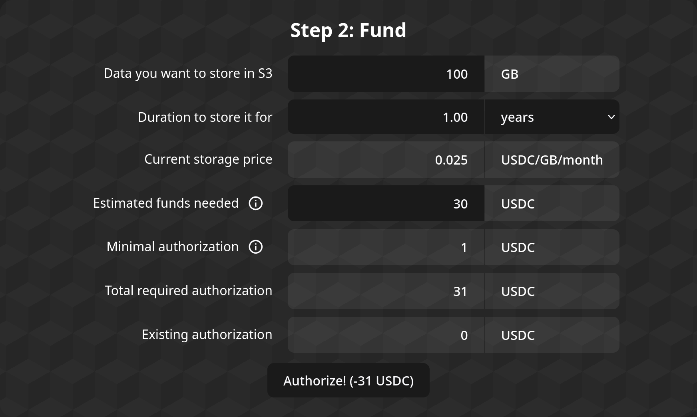

# Using the Aapp

To use the Apocryph S3 Aapp, you can go to [console.apocryph.io](https://console.apocryph.io). There, you should be greeted by the Apocryph Console allowing you to configure payments for the Apocryph S3 Aapp and get a link to login to the Minio Console or S3 API.

## Step 1: Connect

The first step involves connecting your wallet to the Aapp. Currently, the Aapp frontend supports using [Metamask](https://metamask.io) to connect a wallet; Metamask in turn supports passphrase/private key wallets as well as a number of hardware wallets.

To proceed to the next step, you need to connect a wallet.

## Step 2: Fund

The second step is for authorizing the S3 Aapp to access funds for the S3 storage space. The form displays the current price for storage deals (in USDC per GB-month), the currently-authorized amount, as well as fields for configuring the new authorization amount.

You can either input the amount of data (in GB) and duration (in days/years) you want to authorize funds for, using the first two fields, or you can directly use the forth box ("Total required authorization") to input the amount of funds you are allowing the Aapp to access.

When you press the button at the bottom, the frontend would submit a transaction for adjusting the on-chain authorization so it matches the wanted authorization, plus the minimum required authorization.

To proceed to the next step, you need to have authorized at least the minimum amount required. Note that dipping under the required minimum would result in no longer being able to access the Aapp.

## Step 3: Access

Congratulations! You now have an S3 Aapp bucket!

To access your bucket, you can use the buttons in this step; one will launch the Minio interface, while the other will lead you to sample code for integrating the S3 Aapp with your applications' code.

### Web interface

To open the web Minio interface, you should click the "Launch Console" button. It will ask you to sign in with an Ethereum signature, after which it will open a new tab with the Minio Console. If the new tab does not open for any reason (e.g. a popup blocker), you can just click the button again.

Within the Minio Console, you can upload new files using the "Upload" button, and you can configure Bucket policies (such as public access) using the cog wheel in the upper right.

In addition, you could configure Access Keys for programmatic access through the Console, but those will be lost whenever the S3 Aapp undergoes its upgrade process. **Therefore**, you should not use Minio's Access Keys feature for programmatic access, but instead turn to the Programmatic Access option in the S3 Aapp's interface.

### Programmatic Access

To configure programmatic access to your bucket, you should use the "Configure Programmatic Access.." button. It will ask you to sign in with an Ethereum signature, after which it will open up the later steps of the .

To proceed to the next step, you need to sign in for programmatic access; though if you only want access to the web interface, you don't need to do that.

## Step 4: Hack away!

Step 4 provides you with sample code to access your bucket through the Minio SDK. A dropdown at the top allows you to pick your favorite language, while the two boxes below give you a `.env` file with the needed environment variables and a sample of code that uses it to connect to the bucket in the S3 Aapp.

More languages / better language support and support for other S3 SDKs will come in the future.

## Step 5: Profit!

Well, there you have it: your app is storing its files within a storage vault that no one else can access—not even us. Huzzah!

## Further considerations

* Make sure you [attest the S3 Aapp](./ATTESTATION.md) before you start storing sensitive data in it.
