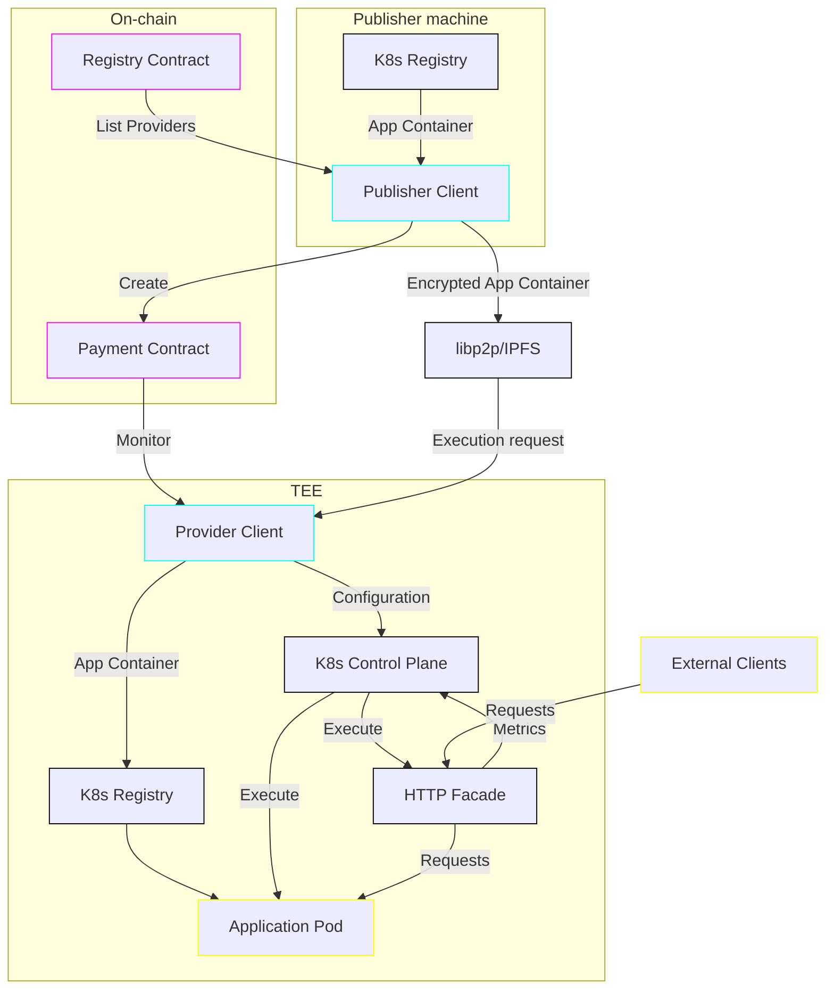
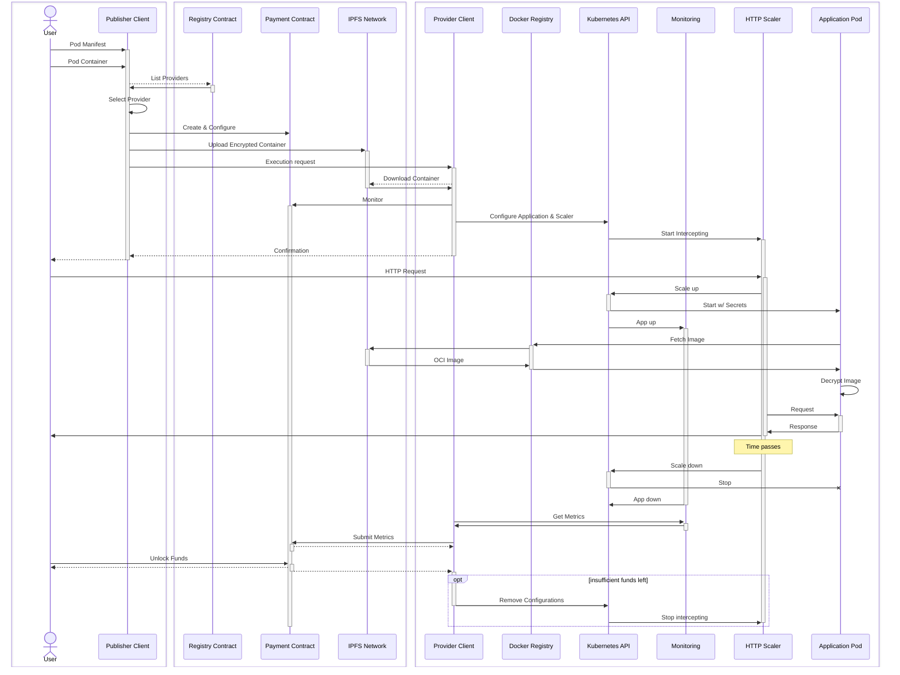

# Architecture

(Document status: mostly complete)

Much of the architecture of Trusted Pods revolves around two key pieces, the "Publisher Client" and the "Provider Client". A publisher is a buyer in the Trusted Pods network seeking to provision their pod/container on the network. A provider is a seller seeking to offer their hardware for rent.

The planned version of Trusted Pods takes care of matching the two and provisioning the pod on a specific target provider. While it offers a way to manually pick a provider, it defaults to automatically picking one for the user. However, it does not take care of operational issues that might subsequently arise; specifically, it does not take care of rescheduling pods when a provider becomes unavailable nor does it make any guarantees about uptime or availability of data—those will be handled in later versions. Such concerns are kept track of in the [backlog](BACKLOG.md).

## Bird's-eye view

As a sequence of steps:

0. The user starts the [Publisher Client](../cmd/trustedpods/) to deploy a container
1. The Publisher Client collects the [Pod Manifest](MANIFEST.md)
2. The Publisher Client gets the list of providers from the [Registry Contract](REGISTRY.md)
3. The Publisher Client selects a provider, using the configured strategy (automatic or by asking the user to manually make a choice)
4. The Publisher Client creates a [Payment Contract](../) and transfers the initial payment amount (possibly in parallel with steps 5-6)
5. The Publisher Client bundles up the Pod Manifest, any related resources, and the Payment Contract's address and sends them to the Provider Client over the [Network Protocol](PROTOCOL.md), encrypted
6. The Provider Client creates the relevant configurations for the Pod using the [Kubernetes API](https://kubernetes.io/docs/reference/kubernetes-api/), including an HTTP Scaler, an Application Pod, and Monitoring
7. The Provider Client confirms receiving the manifest and resources
8. When HTTP requests come in, the HTTP Scaler contacts the Kubernetes API in order to scale the Application Pod up
9. The Application Pod is started using the configuration from earlier
10. The Application Pod handles the incoming requests
11. After a period of no requests the Scaler uses the Kubernetes API to scale the Application Pod down
12. The Monitoring component keeps track of how many e.g. CPU-seconds the Application Pod has run for, and forwards these metrics to the Provider Client
13. The Provider Client submits the metrics to the Payment Contract and is then able to claim the payment due
14. Whenever the Payment Contract runs out of funds, the Provider Client removes the related configurations from Kubernetes

Sequence Diagram

