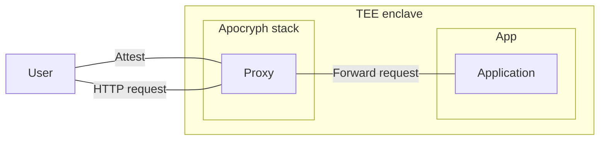
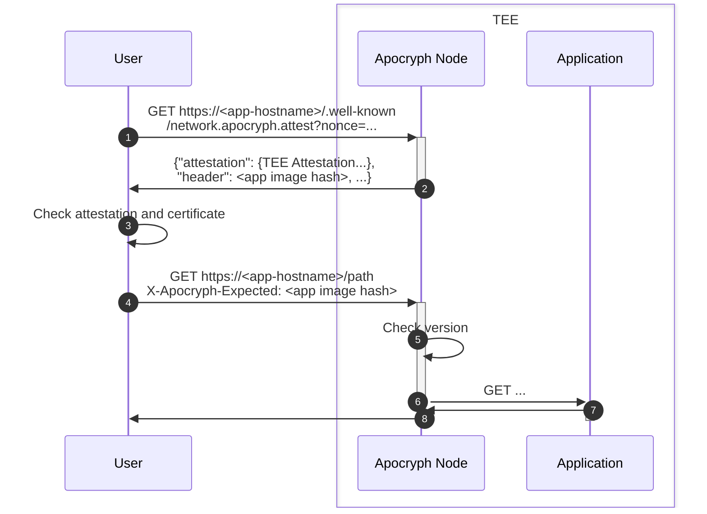

# Attestation

Within Apocryph, all applications running on one providers run inside the same TEE enclave, sandboxed from each other through the use of gVisor. This allows us to use Constellation for all TEE needs for now, while still leaving the door open to switch to per-application enclaves later on.

In order to be able to attest the individual pods deployed through Apocryph, we maintain a facade which (1) attests the whole TEE and (2) forwards the requests to the correct application, as referenced by a full container image hash. That way, end users get what they need: an attestation that their request will be processed by the exact code they expect.

Architecturally, this looks like the following:

## Attesting an application running inside Apocryph

To attest an application in Apocryph, a prospective client needs to do a couple of steps, as outlined in the following diagram:

The first step (1) is connecting to the Apocryph node over HTTPS, and requesting the attestation for the given application. This is done by issuing a GET request to the special path, `/.well-known/network.apocryph.attest`, which the proxy will intercept and serve the attestation for the whole TEE on.

In return (2), the Proxy replies with an attestation value, along with information about the current version of the application running inside the TEE.

The client then has the non-trivial task of verifying that attestation value (3). In particular, the user has to:
* Confirm that the attestation comes from a genuine TEE, by verifying the signatures in the attestation data against Intel's or AMD's certificate
* Confirm that the hashes in the attestation match the well-known hashes of an Apocryph enclave.
* Confirm that the attestation contains a certificate hash, and that it is the same as the certificate hash used in the current HTTPS connection.
* Confirm that the application details, i.e. OCI image hashes, in the returned attestation match the expected app version details. (Application detils can optionally include sigstore signatures, in which case, checking the signature and the key could replace checking an image hash.)

All of that can be automated through either a browser plugin or a lightweight library, which incorporates the above steps.

Finally (4), the client is ready to issue their actual request. At that stage, all they need to do is reuse the TLS connection (or, if establishing a new one, ensure that the new one is using the same attested-to TLS certificate) to send a subsequent HTTPS request, this time to the actual application-specific path they want to access. To ensure that they are connecting to the same application version that was previously attested, the user includes an application version in the `X-Apocryph-Expected` header.

The Proxy running inside the Apocryph node would then forward the request to the currently-running application instance with that specific version (5,6), and proxy the result back, unmodified (7,8).
