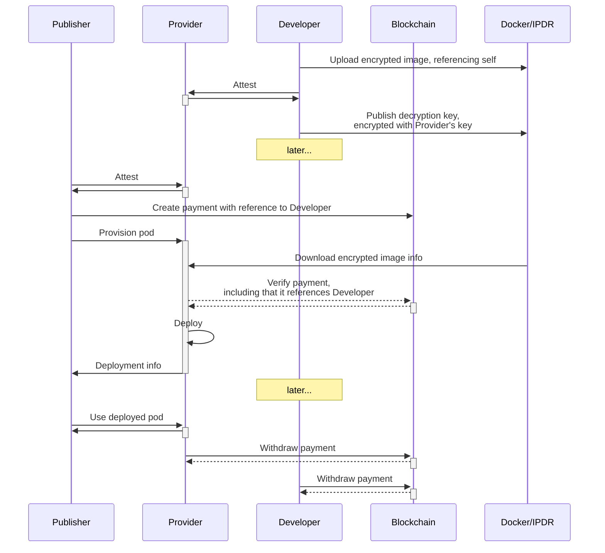

# B2B2X Software Licensing

(Document status: draft)

A useful feature would be to allow publishers to upload application code that other parties can then deploy to a provider -- this would enable usecases such as providing a pay-for-usage subscription to a service where the publisher does not have to take on the risk and responsibility of running a master instance of that service.

This should already be achievable in theory by having a master service which confirms the attestation and licensing status of deployed pods and only then provides them with a decryption key for the rest of the application. However, if it is integrated with the rest of the Trusted Pods platform, we should be able to achieve faster scale-up-from-zero performance, as well as lower some of the counter-party risk of the master service going down.

B2B2X is a feature through which a publisher (second B) can publish a software package (pod) without actually deploying it. Instead, users (X) can take the software and deploy it to providers (first B) themselves (for a fixed price paid to the developer, or a percentage of execution costs, or under some other agreement).

To describe this behavior, we add one extra end user to the rest of the architecture: the "developer". The developer is the one creating pod images, while providers are still the people running Trusted Pods clusters, and publishers are still the people provisioning the exact pods on Trusted Pods providers.

## Implementation in Trusted Pods

If the developer were to upload a complete pod, we run into the problem that this won't allow the publisher to interact with or configure the leased software except through the remote connections exposed by that pod -- disallowing, crucially, small modifications meant to ease the usage of the leased software. Hence, in the proposed implementation, the leased code should be provided as a series of encrypted OCI images, and not as a complete encrypted pod manifest. (Developers are still encouraged to upload sample manifests in addition to the encrypted images.)

Furthermore, if the developer were to upload a pod image encrypted, it would be trivial for users to download the pod image, repackage it, and then upload it as if they are the developers themselves -- and sidestepping the whole B2B2X feature in the process. Therefore, the developer should upload the pod image encrypted, perhaps using the [ocicrypt](https://github.com/containers/ocicrypt) library.

To avoid running into the whole debate of DRM and Software Licensing, instead of letting developers attest providers' TEEs on-demand, we have developers attest providers beforehand, and then encrypt the image keys for those particular providers (or equivalently, and then upload the decryption keys to those providers).

In terms of what will happen in a realistic user story:

* The Developer uses Trusted Pods tooling to upload and encrypt an Docker image they have built locally, and selects a few providers (double-checking attestations) where it would be runnable, then markets their unique software solution through whatever conventional channels they have at their disposal.
* The Publisher (perhaps a "normal" user with a web browser, perhaps a power user using the CLI) finds about the Developer's solution, and includes it as a CID reference in their pod manifest (or uses a manifest premade by the developer). They configure any environment variables, volumes, resource quotas, and additional containers specific to their pod, and once happy with the results, deploy the pod manifest as usual.
  * The CLI or browser interface warns the user that they are using the B2B2X feature, and includes any related costs in the a price breakdown along with explaining what is being paid to the Developer and the Provider.
* The Provider receives the pod manifest, and upon encountering the encrypted image, confirms that the uploaded image can be decrypted by them and that any payment requirements outlined in the image are met by the payment contract details specified in the request.
* The Provider decrypts the container image and starts executing it as normal.
* Upon the Provider submitting a withdraw request to the payment channel, part of the funds gets distributed to the Developer; in way that allows the Developer to withdraw their part independently of the Provider's withdrawal. 

### Edge cases and attacks

* If someone extends a provider's image with extra layers, they can trivially include binaries and modify commands in a way that would allow them to extract the whole contents of that image after it's been decrypted. Hence, the provider must double-check that the decryption keys and payment details refer to the same image id/hash.
* If someone modifies the commandline used to start the image, they can similarly run commands that would extract the whole contents of the image, trivially. Hence, we should disallow changing the container's entrypoint when B2B2X is used (as well as warn developers that the arguments passed to the entrypoint can be customized by the publisher).
* If a provider can only see a stale fork of ethereum, they might be able to run the developer's software without the developer getting paid... though in that case, the provider won't get paid either. This can be prevented through e.g. some variation of the uptime monitoring.
* If someone uses containers from multiple developers in the same pod, the payment channel should be designed in a way that allows specifying multiple developers.
