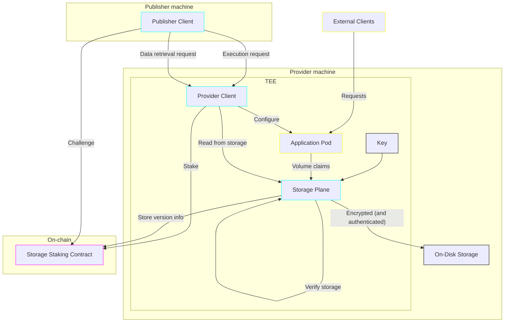

# Storage reliability

(Document status: draft)

For Apocryph to be a viable platform for deploying confidential applications in production, it needs to provide some guarantees about the longevity of data stored on it.

A naive implementation of persistent storage volumes attached to pods as encrypted partitions stored on the provider's cluster runs two major risks: the provider could (intentionally or not) destroy the stored data, and the provider could (again, intentionally or not) revert the data to an older version thereof, thus potentially exposing the pod to various kinds of double-spend-like attacks. The rest of this document attempts to define a protocol for mitigating these risks.

The solution, in brief, is establishing contracts and a protocol for Providers to stake that they will keep the latest stored data available. To identify that data, a version identifier similar to ZFS's root checksum/version is sufficient, with in-TEE authenticated encryption of the volume proving the rest of the data - at which point a container running with the same volume attached can run a full filesystem check and confirm the root checksum/version. If the provider fails to execute a filesystem check within some (generous) time limit in response to a challenge by the publisher, the storage can not be shown to exist, and therefore the stake is lost and can be transferred to the publisher (as a reimbursement for the loss of data).

## Overall architecture

## Storage staking contract

The storage reliability protocol is mainly centered around a contract, the Storage Staking contract. The main purpose of that contract is to let the provider promise that it will not lose data, and, later, to ascertain an eventual data loss and reimburse the publisher for it.

As discussed in [another document](STAKING.md), staking is the main way to ensure the long-term reliability of counter-parties, hence the use of staking here.

Under normal operations, the provider stakes a certain amount in the storage contract as part of the pod provisioning process. Afterwards, the Storage Plane starts periodically publishing the newest version of the storage medium to the contract (or alternatively, to a suitable alternative network that allows fetching the last version and for ensuring that versions are strictly increasing at all times). Then, whenever the storage plane is restarted, it would fetch the latest version in the contract, and compare it to the version in storage -- which should be equal or greater.

The staking contract has to handle four edge cases:

1. The provider goes offline / disappears / loses the data. In this case, the contract should allow the publisher to issue a challenge which can only be answered by the Storage Plane component. If the challenge remains unanswered in a certain period of time (typically: multiple days, to allow for cluster recovery procedures), the stored data is presumed completely lost.
2. The provider reports an unfixable data corruption / older data version than expected. In this case, the contract should automatically issue a challenge for the provider to fix the data; meanwhile, the publisher can request the data directly (as the application pod should not be started with stale or corrupt data). If the Storage Plane does not answer the challenge by confirming that the newest data is available, the contract MAY refund partial stake to the provider for keeping a relatively-recent backup or a partial amount of the data, but should otherwise reimburse the publisher. <!--TODO: the alternative here is to make any data corruption equivalent to full data loss; this might avoid the case for point 4 below, but can also cause more data loss in cases where partial data can be recovered--> 
3. The publisher stops paying for the application pod's execution and storage use. This case bears further consideration, <!--TODO: the alternative here is to make paying for storage separate from paying for execution--> but a grace period during which the publisher can fetch the application's data should be implemented at minimum.
4. Finally, the contract should allow the publisher to claim the stake in cases where the provider is refusing / unable to provide the state as stored over the data retrieval protocol.

In all of those cases, the storage contract should be trusted by both the publisher and provider.

## Storage Plane

The Storage Plane is a Kubernetes Storage Provisioner tasked with creating and managing volumes within the TEE and ensuring the data stored on them is encrypted before leaving the TEE. In addition, it monitors these volumes for data corruptions, and communicates with the Staking Contract to ensure no rollbacks occur.

To maintain a volume version suitable for the Staking Contract, the Storage Plane has one of two options. The first one, a relatively involved one, is to maintain a Merkle Tree -like structure of encrypted directories and files, similar to the UnixFS structures in IPFS, and record changes to the root node's hash. This option has excellent tamper resistance, due to the usage of cryptographic hash functions to ensure data authenticity, however it is likely to be too slow for applications that make heavy use of on-disk storage. Therefore, we propose the second option, using a standard filesystem that supports hierarchically checksumming the whole filesystem and versioning the root inode, such as ZFS ([1](https://openzfs.github.io/openzfs-docs/Basic%20Concepts/Checksums.html), [2](https://openzfs.github.io/openzfs-docs/man/v2.2/7/zfsprops.7.html#createtxg)) or Btrfs ([1](https://btrfs.readthedocs.io/en/latest/Checksumming.html), [2](https://btrfs.readthedocs.io/en/latest/btrfs-man5.html#generation)) <!--and possibly Ceph, as it also has checksums + snapshotting-->. In this scenario the filesystem is configured with encryption enabled, and it's own native checksumming capabilities take care of verifying block contents read from the external-to-the-TEE disk storage. Meanwhile, we use the version numbers stored by the filesystem either natively or as part of its snapshotting mechanism (e.g. transactions in ZFS, generations in Btrfs) for version information sent to the staking contract.

## Disk encryption

Volume contents should be encrypted using a key which is either pod-specific (and thus configured as part of deploying the pod), or cluster specific; in either case, the key should not exist on the provider's machine outside the TEE, as that would defeat the whole purpose of deploying confidential applications.

Using a pod-specific key has the advantage that the volume could be sent encrypted when doing data retrieval; but comes at slightly higher risk of compromise.

## Data retrieval

Publishers can currently update a pod to change its code at any time. Given that it would be trivial to change a pod so that it exposes an API for reading (and/or writing) to storage directly, it makes sense to consider exposing that interface to the publisher directly from the provider client / storage plane. This could be done with an additional API which allows either browsing directories similar to FTP(/WebDAV) or that allows bulk storage download (as tar or encrypted volume) for purposes of debugging the application state, moving state to a different provider, or local backups. As the provider client runs inside the TEE, it should not be possible for the provider to decrypt data-downloading traffic, and, as long as the provider client does not leave an exploitable attack surface that allow arbitrary reads, it should keep the stored data confidential to the publisher.

As mentioned in the staking contract section, an issue that arises is proving that the provider is not censoring outbound data transfers (for the purpose of e.g. keeping the data hostage). FileCoin solves that by carefully aligning incentives through retrieval fees and payment channels -- and it would seem there is not much that can be done other than incentivizing the provider to cooperate, as it is impossible to differentiate between the provider not sending a dataset and the publisher not receiving it fully, other than perhaps introducing an additional trusted third party. <!-- TODO -->

## Backup

A different approach to improve storage reliability would be to use multiple backups. Smart contract staking would already allow for the provider to back up the encrypted storage medium in multiple locations (with or without changes to the storage plane), and then offer a much higher insurance premium for that more-reliable storage. However, backups are often useful for more than just reliable storage, as they provide additional historical data.

Therefore, a dedicated backup solution or integration might be worth even with the introduction of storage reliability staking; application developers can already run a pod that includes all needed infrastructure for backups, but having that baked into the core Apocryph offering could be a benefit for users still. Either way, ensuring storage reliability through staking would prevent a range of potential malicious provider behavior, and as such would be a good step regardless of whether it later expands to encompass backups or whether backups remain separate altogether.
