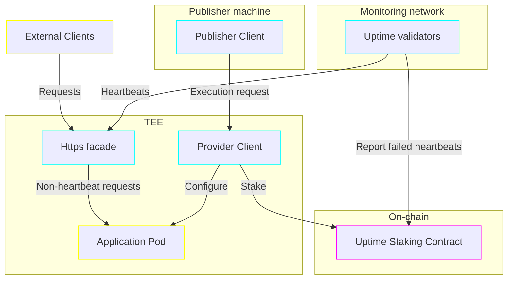

# Uptime staking design

(Document status: draft)

As Trusted Pods aims to become a viable option for deploying big and small application pods in production, it's important that not only the confidentially and security of the pods is enforced, but also their uptime and availability. While scale-down-to-zero pods might never have great first response latency, even for them Publishers should be able to ask for reliable uptime, a guarantee that the system will remain up an running. And, as discussed in [another document](STAKING.md), staking is our main weapon in ensure the long-term reliability of providers, hence uptime would also use staking.

The following document attempts to describe a protocol for staking based on the uptime of applications, similar to what the cloud industry is already doing with [SLAs](https://en.wikipedia.org/wiki/Service-level_agreement). A fair bit of the protocol deals with proving that the application was down due to a fault of the provider and not of the publisher.

## Schematic

The main challenges of uptime monitoring in a decentralized environment like that of Trusted Pods are twofold:

1. First, internet connectivity is not as simple as a boolean yes/no, and there are cases in which a client cannot access a web server despite that server being perfectly accessible by others.
2. Second, it's possible for a server to be reachable, but the application to be unable to respond to requests, e.g. because of programming errors.

To deal with the first challenge, this document suggests using a decentralized network of validators that check the liveliness of a particular provider/pod combo. Then, to deal with the second challenge, this document suggests running a container replying to heartbeats next to the application.

## Monitoring network

The network of validators monitoring the various pods running within Trusted Pods ideally needs to reflect the internet connectivity of those pods' users. In addition, it would ideally be unbiased towards the particular providers and publishers; that is, the nodes comprising the monitoring network should not have an incentive to blacklist a particular provider, nor should they have an incentive to report connection failures for a particular publisher. Unfortunately, neither of those two can be proven with a TEE or similar construct, as they involve network conditions between potentially-trusted machines.

In addition, while it is plausible to run monitoring nodes in Trusted Pods or other cloud providers, neither is a particularly good way to run such nodes, as both cloud providers and more so Trusted Pods providers would benefit, in the long term, from having less competition, and as such are not unbiased sources of measurements.

As to the workings of such a network, it's likely that it would best function probabilistically; that is, each node checking various pods at (pseudo-)random. If a given pod fails to reply to the heartbeat endpoint, the monitoring node would forward the request to other monitoring nodes for confirmation; and if a certain fraction of the monitoring network agrees that the pod is down, the combined signature is forwarded to the uptime staking contract.

In order to protect the monitoring network from Sybil attacks, whereby an attacker inflates the amount of monitoring nodes to sway the network to count a given pod as failed / alive, some version of Quadratic Staking could be employed.

And in order to incentivize the monitoring network, the uptime staking contract should require some small-but-sufficient portion of the staked value to be committed towards funding the monitoring network.

Finally, to deal with large-scale network outages (such as an internet blackout in a particular country), the monitoring network could have a function to detect times at which there are multiple failing nodes, and include that information in interactions with the staking contracts.

Altogether, all of this would make a good implementation of the monitoring network a large undertaking on its own -- and indeed, it is likely that such a reliable decentralized uptime monitor could have value outside of the Trusted Pods network itself; hence it could be good to turn it into its own spin-off project. That being said, a prototype of the monitoring network wherein providers monitor each other should be good enough to boot.

<!-- TODO: NOTE: An alternative here is to have no heartbeats, but instead to have a monitoring network that users can route requests through to get a signed confirmation that the request gets no response -- along with ensuring the facade always returns at least *some* response. -->

## Heartbeats

A purely self-interested provider would like to, assuming it costs them less than acting normal, avoid running the application as much as possible while still collecting the rewards as if it ran that application. Since [metrics](PRICING.md) run inside the TEE, the provider is already incentivized to let the application run in response to incoming requests (otherwise, they won't get paid for that). That being said, a malicious provider could still try to censor requests to the application, perhaps because they have over-leveraged their hardware and can't actually run that application. And since they have staked to the uptime contract, we would like them to lose their stake in case they are online but censor requests for a given pod -- in addition to losing stake when offline.

On the other hand, a self-interested publisher would like to collect the uptime stake even when they haven't actually experienced downtime. Therefore, we want to protect the provider from pods that try to make it look like the provider is currently down.

Hence, this document proposes adding heartbeats as requests that can be sent by the monitoring network but are made indistinguishable by virtue of happening inside a TLS/HTTPS envelope. This would require pods to hand their HTTPS certificate over to the HTTPS facade that routes requests to them, as opposed to just baking all HTTPS logic into the pods themselves. In return, their publishers can use uptime monitoring and uptime staking. <!--NOTE: an alternative here is to allow the monitoring network to send broken TLS requests that are indistinguishable from normal network requests outside the TEE, then intercepting those at the facade and responding with a heartbeat there.-->

To further make heartbeats undistinguishable from non-heartbeat requests, there could be options to send heartbeat requests and responses of certain sizes and latencies, thus resembling real requests more closely -- but the need to do so is likely way into the future.

## Uptime staking contract

Finally, the piece tying the monitoring network and heartbeat response facade up is the on-chain staking contract. Similar to the [storage staking contract](STORAGE.md), under normal operations, the provider stakes a certain amount in the uptime contract as part of the pod provisioning process. Afterwards, whenever the pod experiences downtime, the monitoring network would submit transaction/s outlining the time during which the pod was inaccessible.

Brief periods of downtime are naturally less damaging than prolonged downtime. Thus, when modelling the downtime, more weight should be given to longer periods, while periods of downtime shorter than a certain length could be automatically ignored -- though without opening the doors to providers cheating the system by intermittently restoring connectivity in order to split a long period in two. Furthermore, to be able to convert the staked amount to the more-standard format of "nines", there probably ought to exist some notion of downtime over a fixed/rolling period of time.

A way to fit both of those requirements would be to weight periods of downtime according to a sigmoid or (truncated) quadratic function, and combine periods of downtime that are within a certain time of each other (e.g. if the application is down for an hour, it needs to be up for a whole day before the next downtime would be counted separate from that 1 hour.) Then allow partial slashing of the provider in cases of downtime, whereby not all stake is lost in the case of an incident. Finally, to compare to a certain amount of nines, compute the downtime that would incurred over the course of one period + reset, then compute the pay-out for that downtime to get the "reimbursed amount for downtime beyond X nines".

An edge case that has to be considered is when the publisher stops paying for the application pod's execution. In that case, the uptime staking contract should ignore any further reports of downtime, as the pod is no longer protected; the provider is likely to reclaim the stake once that occurs.

Another edge case is planned maintenance. While initial versions of the uptime staking contract would ignore that, future versions could have allowances for certain amounts of downtime if those are announced in advance by the provider.
